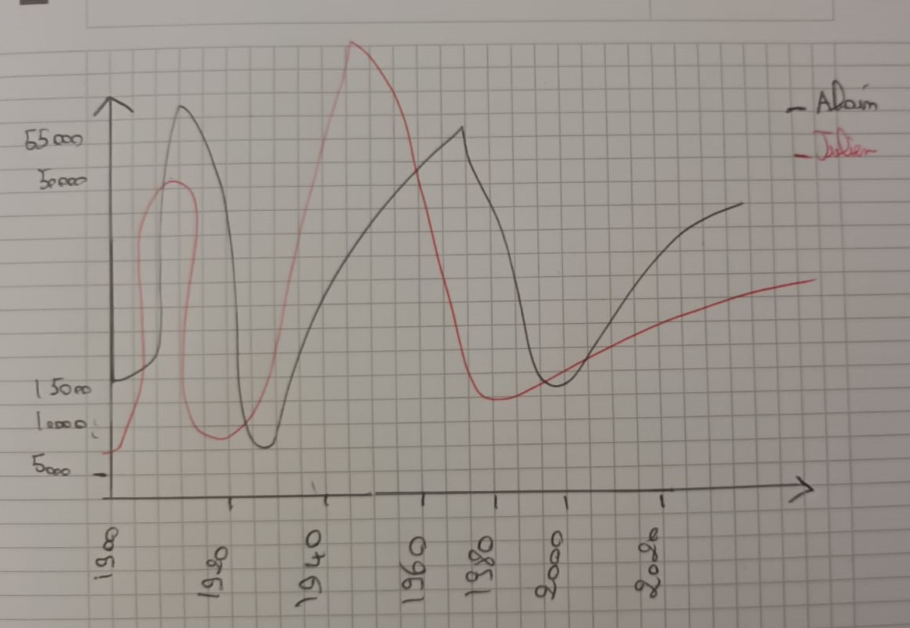
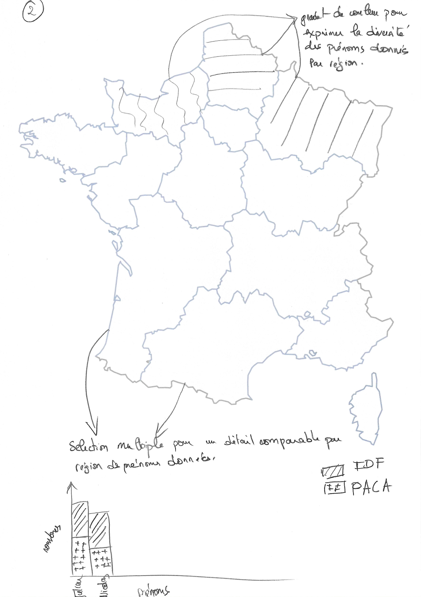
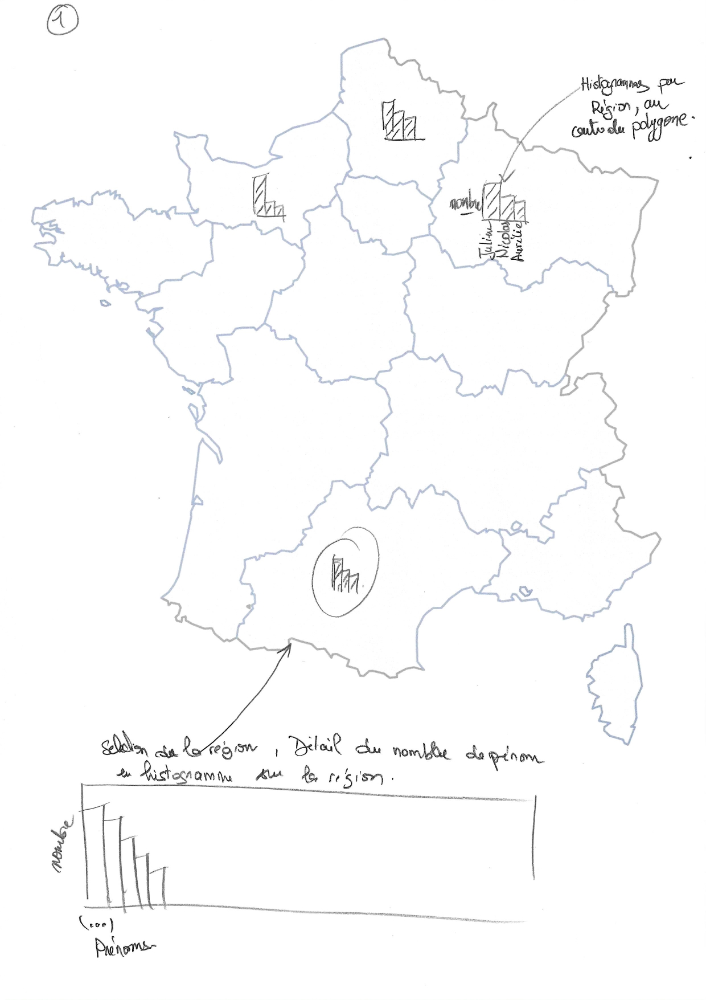
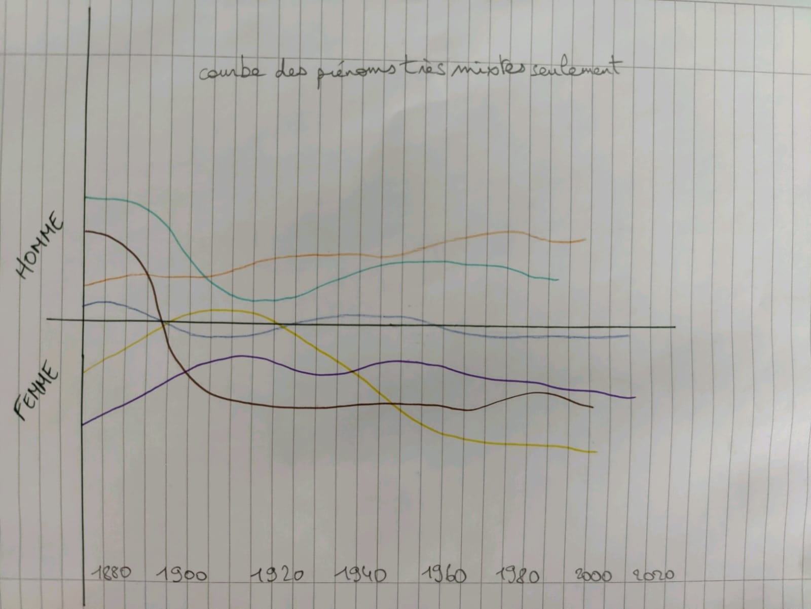
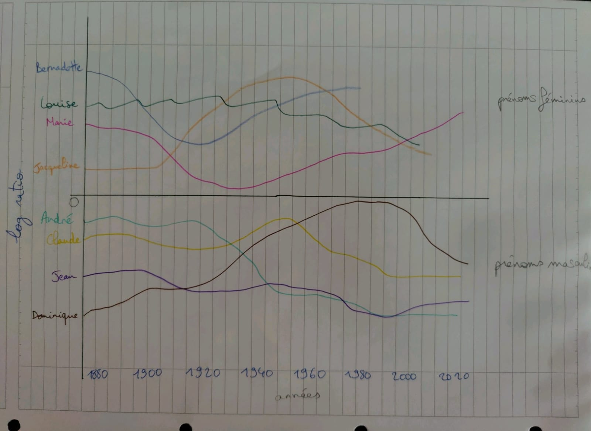

# IGR204-baby-names
GROUP N

## Visualization 1 (Altair)

### Sketches

### Conclusion
We notice that the first names tend to evolve in a bell shape. They gradually increase until they reach a maximum value before gradually decreasing in the same way. Most of the names do not have a constant popularity. Some first names also never had success like Léno or Médea (graph 3 in notebook). 

We can also see that some first names have known a great popularity in a brief way as Philippe between 1955 and 1970. We can also notice that this same first name is absolutely not more popular since about twenty years. Finally, we can observe a trend in the time which seems to be polynomial and approximately of degree 2 for all the first names.

## Visualization 2 (Altair)

### Sketches

### Conclusion
This visualization gives a fair insight into which names are the most popular in the country thanks to the geo option of Altair. 
The user can click on a region and filter the names, it displays a bart chart with the most given names at birth. This gives us a great display on the trendy names since 1986.

## Visualization 3 (Altair)

### Sketches

### Conclusion
Popularity of baby names used for both genders rised around the 50's then suffered a little drop 20 years after. For brief periods we notice short trends like Nathalie's name that quickly vanishes, it is not popular amongst male anymore. Names like Dominique and Claude who are commonly used for both women and men have evolved consistently and are still trendy nowadays. 

