# IGR204-baby-names
GROUP N

## Visualization 1 (Altair)

### Sketches
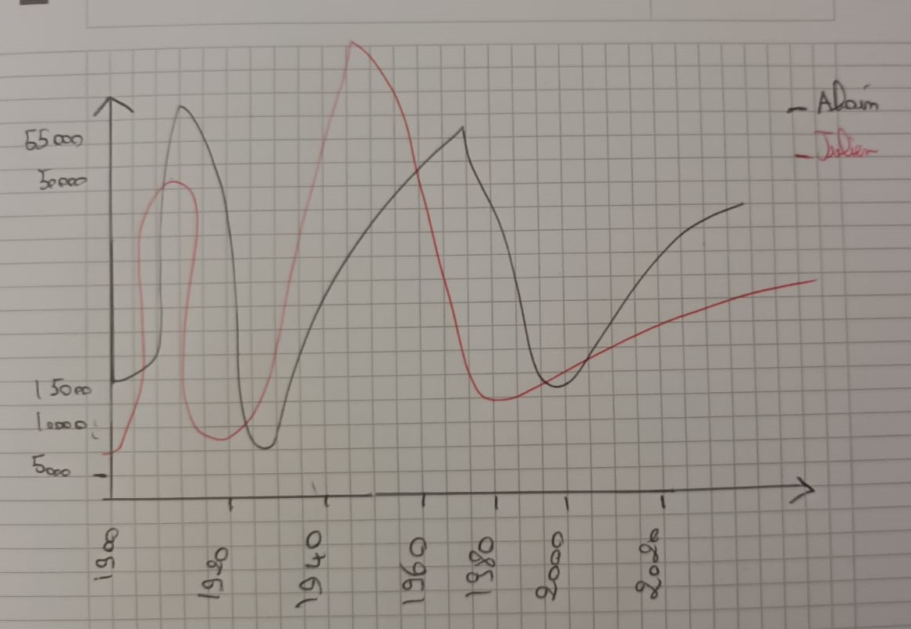
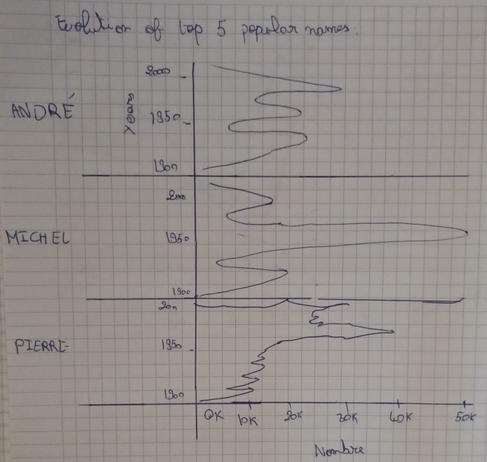
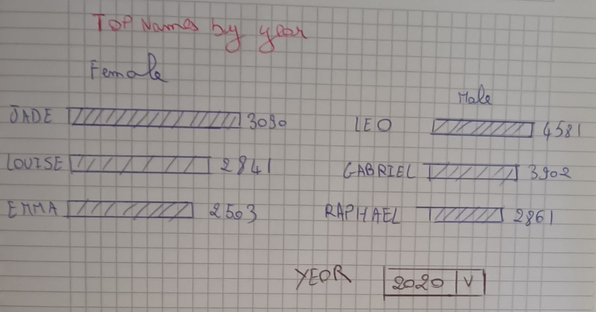

### Chart (interactive)
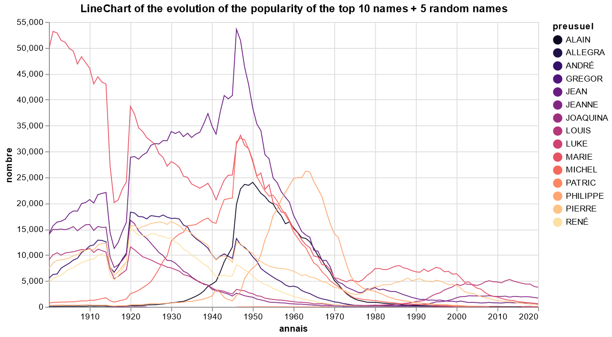

### Comments

**NB**: The visualization is interactive, so it is necessary to download the notebook and run the cells

- Precisions about the choice of this Visualization : I chose to use a line chart because it is quite relevant in the context of time series. To avoid the spaghetti effect and to be able to clearly observe the evolution of the popularity of each name, I chose to make the visualization interactive. Finally, the choice of Altair seemed natural to me because it is easy to handle and integrates perfectly in jupyter notebooks.

- Answers to questions about Visualization 1 : We notice that some names in the top 10 seem to evolve in a bell shape (ex : Alain, Philippe, Jean). They gradually increase until they reach a maximum value before gradually decreasing in the same way. Most of the names do not have a constant popularity as explained before. Some first names also never had success as we can see for Rohit or Carmelia.

    We can also see that some first names have known a great popularity in a brief way as Philippe between 1955 and 1970. We can also notice that this same first name is absolutely not more popular since about twenty years. Finally, we can observe a trend in the time which seems to be linear and sometimes polynomial (deg 2) for Alain and Philippe for instance.

## Visualization 2 (Altair)

### Sketches
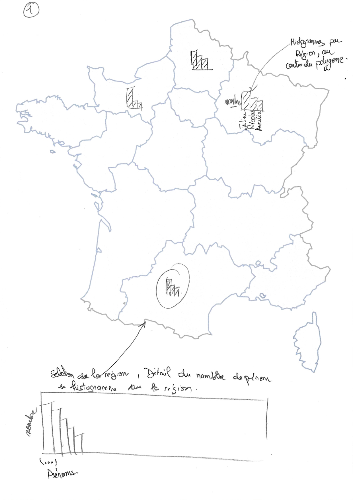
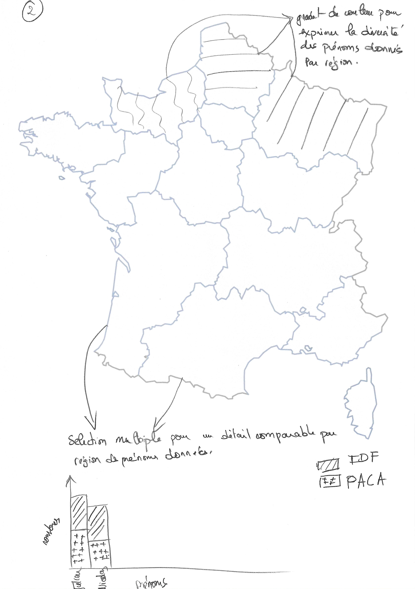

### Chart (interactive)
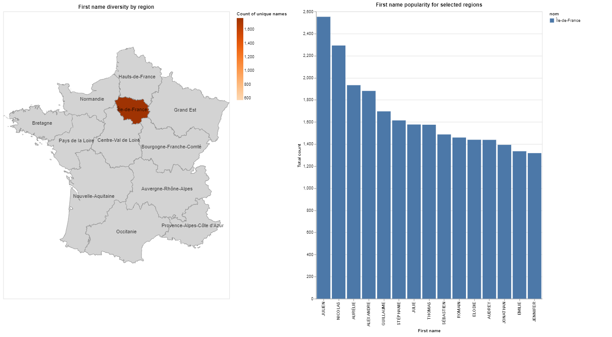

### Comments

#### Discussing choice of visualization and figures
The purpose of visualization 2 is to highlight the regional effects across the dataset.
Using a map with the regions of France as a layout offers in our opinion a good balance between the granularity and readability of the data we intend to display.
We chose standard histograms to encode the regional count of given names, we have discarded other ideas for scalable data point size inside each region for a given name (as a text label or a bubble), as those were in our opinion hard to position correctly within the region map polygons with little to no overlapping and with enough data points to make a compelling visualization.
We felt the answer to the question in terms of given name diversity was a way to demonstrate the regional effect of the data, we chose to apply color gradients on the map to encode this information.

From there on we had to answer another question: Can the questions be answered with ease and accuracy with a single visualization?
The first sketch was an attempt to answer all the questions with a single visualization, with given name, count histograms located at the centroid of region polygons, and color gradient by given name diversity over a region.
Although this candidate would highlight regional effects in the data, the popular names by region, the relatively small size of the histograms (that would need to fit in a region polygon), makes it harder to compare across regions and more importantly limits the number of names in the display.

The second sketch is an attempt to overcome the limitations of the previously designed sketch by adding a selection based stacked bar chart, enabling comparison of given name popularity between regions. We would add that the downside to this sketch is that an important amount of data is now encoded in the bar chart, leaving the map with fewer information encoded. We then chose to reduce the size of the map relative to the bar chart while still leaving it at the top, as the selections on the map enable the display in the bar chart.

#### Implementation details
On the implementation end, the map layout required France region polygons to draw the map, geopandas was used to load the geoshape file and compute region polygon centroids for region name text labels. Insee dataset were use to build mappings between regions and departments (the dataset has only the department feature) as the visualization requires region level aggregated data.
The dataset was filtered on a specific year (the choice of year was arbitrary) only for on technical reason: notebook size seemed to increase with input dataset size, after some research it appeared that vega compiled visualization holds the dataset serialized as json. There are better dataset reduction solutions that come to mind but given the fact the time was not relevant dimension in the visualization, we simply filtered on the specific year.
The visualization was designed using Altair, linked and stacked horizontally:
* The combination of 2 charts for map layout and text labels, enabling multi-selection
* The stacked bar chart, filtered on the map selected regions
Enabling easy comparison across 2 up to all region in France.

The choice of Altair as a visualization framework was mainly a personnal preference for its API (over D3), and expressiveness (over Tableau) I find code to be more expressive than equivalent drag and drop visual tools.

## Visualization 3 (Altair)

### Sketches
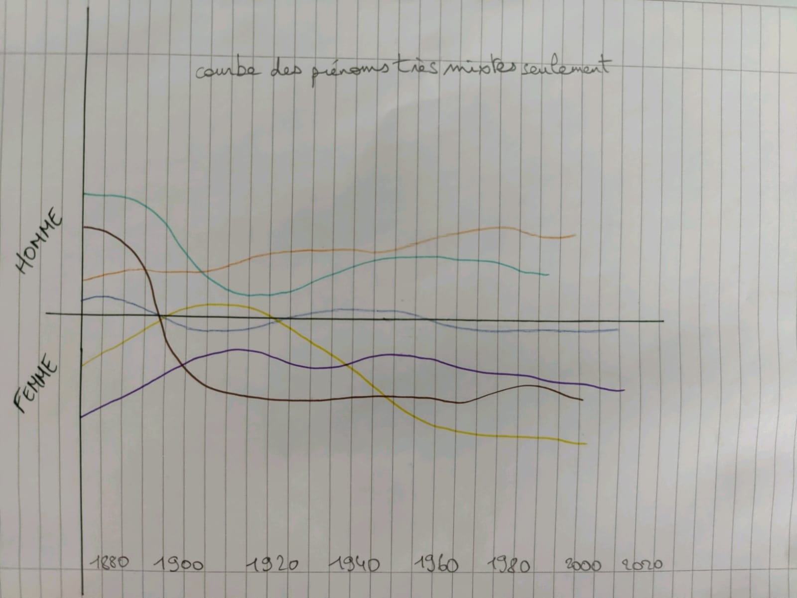
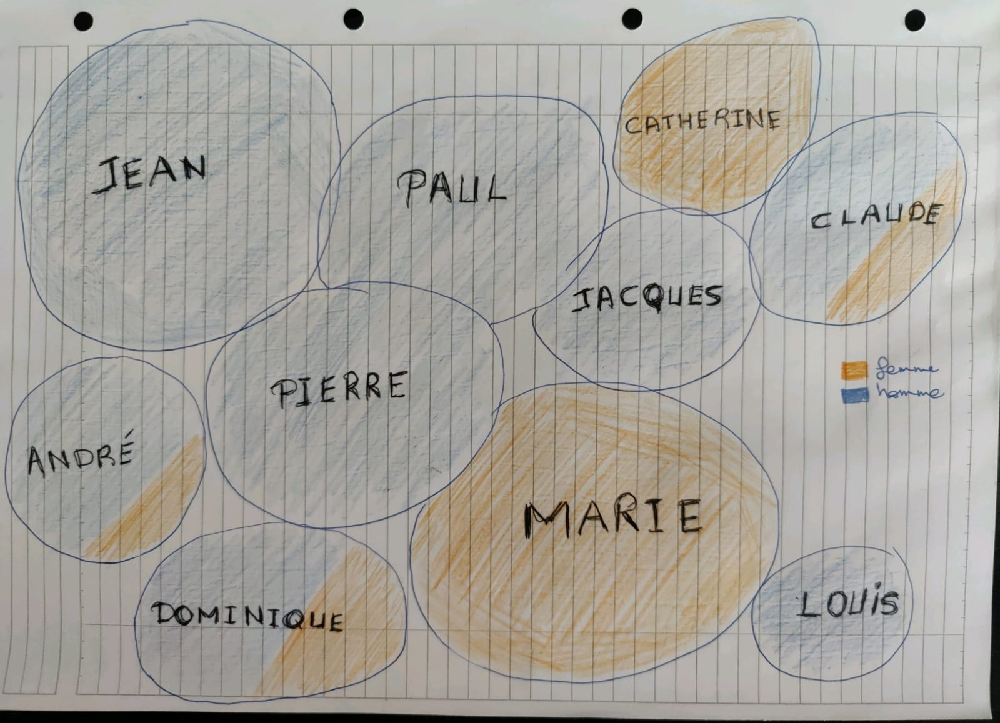
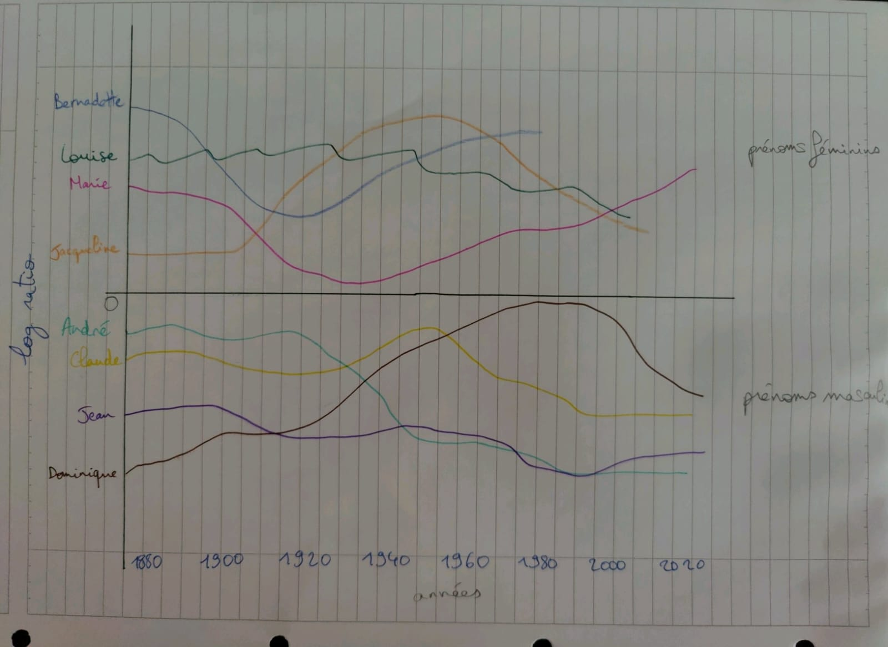

### Chart (interactive)
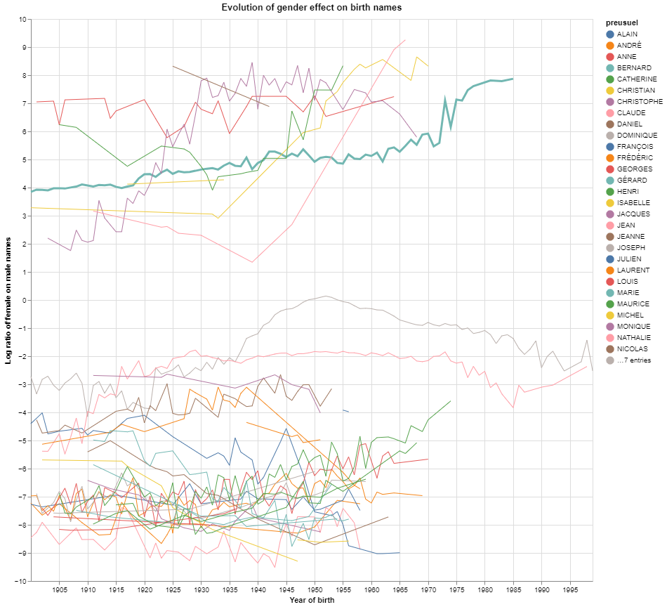

### Comments

#### Discussing choice of visualization and figures

The aim of this visualization is to highlight the effect of genders on names and if any trend would be noticeable throughout the years. A chart with an appropriate data processing is the key to answering.

In the first place we made different sketches to implement the best visualization. The first one is a line chart with a display of unisex names for the whole period. This chart shows which names are more popular among males and females and its evolution, but it does not expose the gender effects on names and would make the visualization biased.

The second sketch is an attempt to scheme most popular names by using a bubble chart. Each bubble shows a name and the color encoding the percentage of usage amongst males and females. The bubble size reflects the popularity. Again, this chart doesn’t consider the evolution during the years.

For the last sketch we searched through the courses and found the log ratio used in a similar case. We made a line chart and applied a log ratio to remove any bias. The idea is to take the top names and display it on the chart, the names close to the baseline are amongst the most popular for both genders. We chose this sketch because it answers both questions.

#### Implementation details

Altair is an easy way to display and manipulate data and in our case, we have to apply a specific formula.

We chose a line chart because it’s a simple way to show an evolution of data over a period. We selected the top 40 names of the dataset and applied a log ratio on each in order to reveal the gender effect. The top side of the chart matches female names and the bottom male names.

Each name is encoded by a color for differentiation purpose and is highlighted when clicked upon. It allows the user to know which name is associated to a line.

By analyzing the chart, popularity of baby names used for both genders rose around the 50's then suffered a little drop 20 years after. For brief periods we notice short trends like Nathalie's name that quickly vanishes, it is not popular amongst male anymore. Names like Dominique and Claude who are commonly used for both women and men have evolved consistently and are still trendy nowadays.

